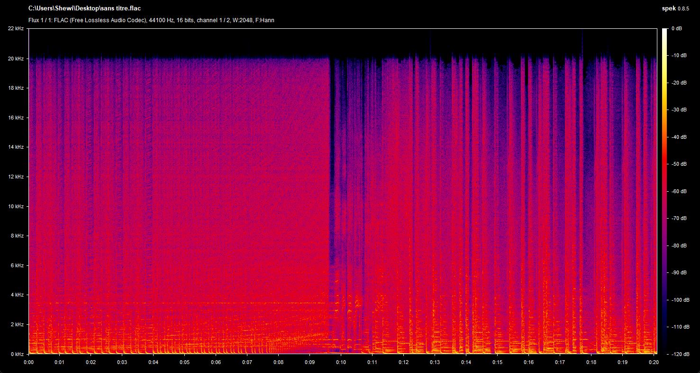
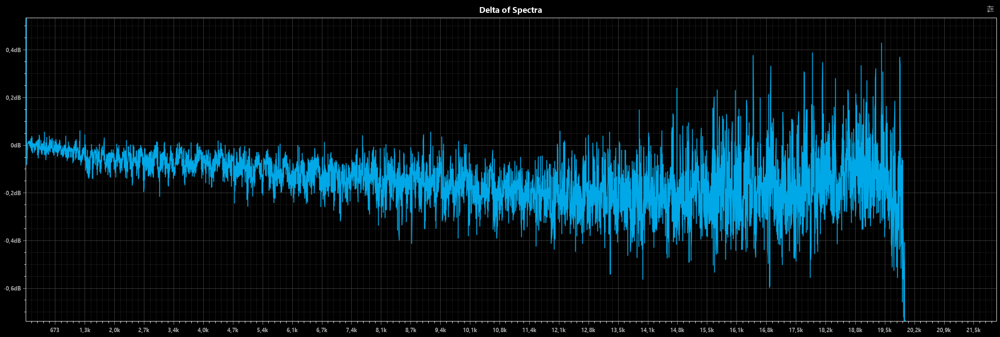
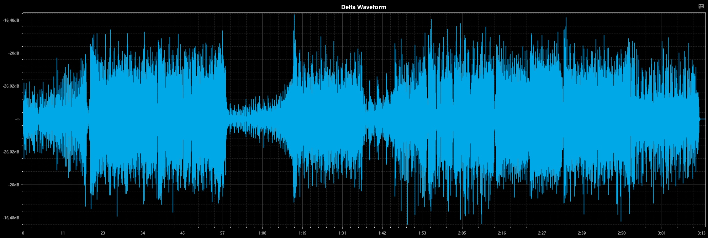

  
  
Art by Shironappa

  <h1>Ugoku-v2 Discord Bot</h1>

**A work in progress rework of [Ugoku !](https://github.com/Shewiiii/Ugoku-bot)**, completely refactored and lightweight~  
Thank you again [Chinono](https://github.com/ChinHongTan) to help me on that project, much love <3

<h2>Features/To do</h2>

- [X] Ping.
- [X] Echo messages (make the bot say any message).
- [X] Download stickers from LINE.
- [X] Download songs, albums or playlists from Spotify. (WIP)
- [X] Play songs in a voice channel.
  - [X] Skip, Show queue, Autodetect and add songs/albums, or playlists.
  - [X] Loop song, Loop queue, pause, resume...
  - [X] Amazing audio quality: bypass the channel's audio bitrate.
  - [X] Stream songs from Spotify.
  - [X] Stream videos from Youtube.
  - [X] Stream audio works (音声作品) in a voice channel (because why not).
  - [X] Play songs from a URL (custom source).
  - [X] Cache audio from custom sources.
  - [X] Embed info messages with metadata.
  - [X] Show the lyrics of a song using musixmatch API.
  - [ ] (outdated) Control the bot using [this amazing UI](https://github.com/ChinHongTan/Ugoku-frontend) !

- [X] Chat using Gemini 1.5 Pro. (WIP)
  - [ ] Optimize token usage.
  - [X] Make its messages more human-like.
  - [X] Have a permanent memory!
- [ ] And maybe more in the future~

<h2>Known bugs to fix</h2>

- Queue not showing when too many characters in the queue/loop section. (mostly the case with onsei)
  ("In data.embeds.0.fields.1.value: Must be 1024 or fewer in length.").

<h2>Audio benchmarks</h2>

> [!NOTE]
> Ugoku-v2 is only using Spotify as a music streaming service source, so the best audio chain (besides custom sources) is OGG 320kbps -> Opus 510kpbs. I'm planning to implement Deezer as a streaming source to the bot, in order to get the best possible audio quality out of any discord Bot.

  
  
Spectrogram of the bot's audio output of a Spotify song with "Very High" audio quality.

  
  
Predicted delta vs. lossless audio track (~0.6dB y-scale).

  
  
Delta waveform vs. lossless audio track (~-17dBFS y-scale).

Comparison vs. other music bot to add.

