

  
  
Art by Shironappa

  <h1>Ugoku-v2 Discord Bot</h1>

**A work in progress rework of [Ugoku !](https://github.com/Shewiiii/Ugoku-bot)**, completely refactored and lightweight~  
Thank you again [Chinono](https://github.com/ChinHongTan) to help me on that project, much love <3

<h2>Features/To do</h2>

- [X] Ping.
- [X] Echo messages (make the bot say any message).
- [X] Download stickers from LINE.
- [X] Download songs from Spotify.
- [ ] Download lossless songs from Deezer. (WIP)
- [X] Play songs in a voice channel.
  - [X] Skip, Show queue, Autodetect and add songs/albums, or playlists.
  - [X] Loop song, Loop queue, pause, resume...
  - [X] Amazing audio quality: bypass the channel's audio bitrate.
  - [X] Stream songs from Spotify.
  - [X] Inject lossless streams to Spotify songs (when available on Deezer).
  - [X] Stream videos from Youtube.
  - [X] Stream audio works (音声作品) in a voice channel (because why not).
  - [X] Play songs from a URL (custom source).
  - [X] Cache audio from custom sources.
  - [X] Embed info messages with metadata.
  - [X] Show the lyrics of a song using musixmatch API.
  - [ ] ~~(outdated) Control the bot using [this amazing UI](https://github.com/ChinHongTan/Ugoku-frontend) !~~

- [X] Chat using Gemini 2.0 flash. (WIP)
  - [ ] Optimize token usage.
  - [X] Make its messages more human-like.
  - [X] Have a permanent memory!
- [ ] And maybe more in the future~

- [X] Review jpdb cards in Discord (sentences generated with Gemini)
- [X] Search any word in Japanese

<h2>Known bugs to fix</h2>

- Example sentences not always well chosen (Gemini, rare but still)
- The song in vc may stop randomly
- Audio is slowing down at the beginning of a song

<h2>Plublic playground bot</h2>

Chatbot and Spotify streaming features are disabled, but you can still play with the bot !
 [Invite link](https://discord.com/oauth2/authorize?client_id=1260656795974897695)

<h2>Random screenshots</h2>

  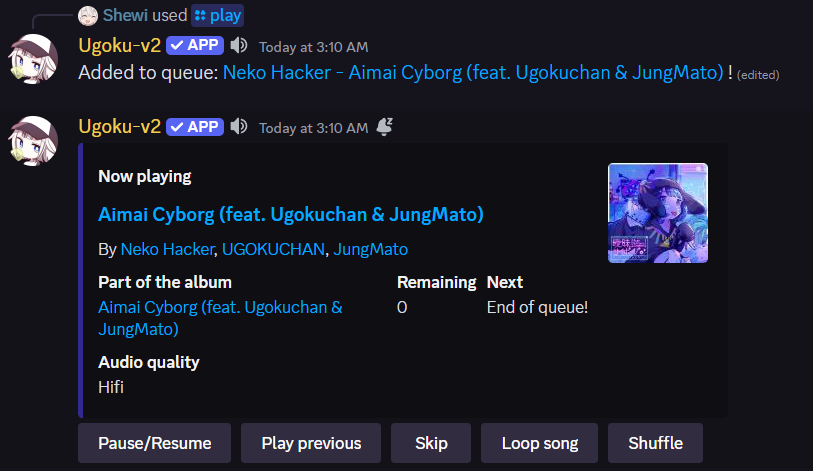
  
Playing a song

  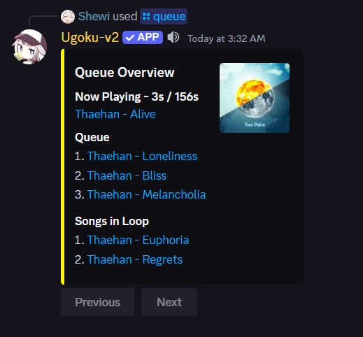
  
Songs in queue

  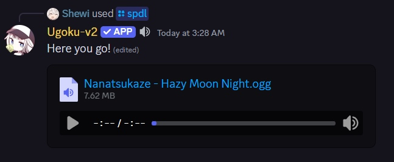
  
Spotify song download

  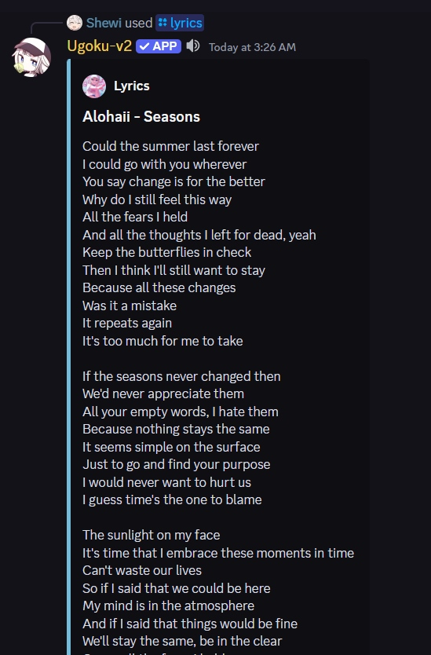
  
Lyrics

  
  
Youtube & text summary

  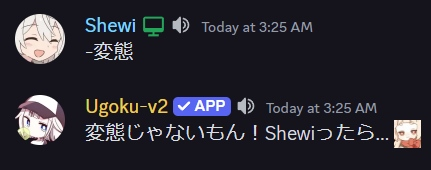
  
Random message w

<h2>Audio benchmarks</h2>

> [!NOTE]
> Deezer has finally been integrated into Ugoku! Lossless audio content will now be injected in Spotify tracks before playing (when available). Ugoku now offers the best audio quality possible for a Discord bot, nearly indistinguishable from true lossless audio...except for occasional lags.

> Benchmark reference:
> - Reference track: Ayiko - Tsundere Love
> - Reference source: Deezer, FLAC  
> - Comparison softwate: Deltawave
> - Time: ~0-30 seconds  
> - Amplitude normalization: -10dBFS
> - Normalized with: Audacity
> - Downsampled with: Audacity
> - Recorded with: VB-Audio Hi-Fi Cable (Bit-perfect virtual cable, Jockie)
> - Converted with: FFmpeg (Ugoku)
> - Recording method:
>   -  Ugoku: Convertion with FFmpeg with the corresponding audio chain
>      -  FLAC -> Ogg 320 -> Opus 510 ("High" quality)
>      -  FLAC -> Opus 510 ("Hifi" quality)
>   -  Jockie: Record Discord's audio output with the virtual cable
> - Audio quality:
>   -  Ugoku: High (Spotify), Hifi (Deezer)
>   -  Jockie: No Patreon subscription to Jockie

<h2>Results:</h2>

  <h2>Delta of spectra (Lower absolute value is better)</h2>
  <h3>Ugoku, Hifi quality:</h3>
  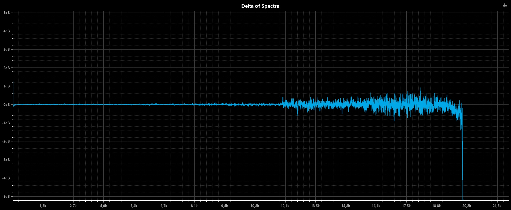
  <h3>Ugoku, High quality:</h3>
  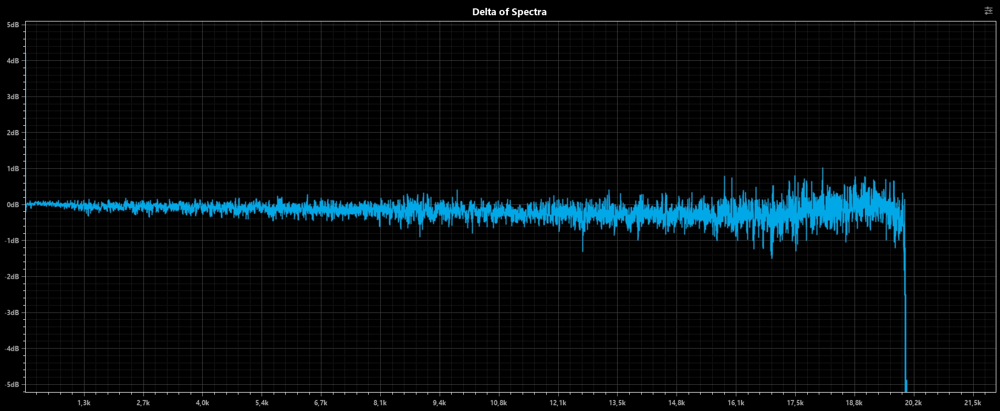
  <h3>Jockie:</h3>
  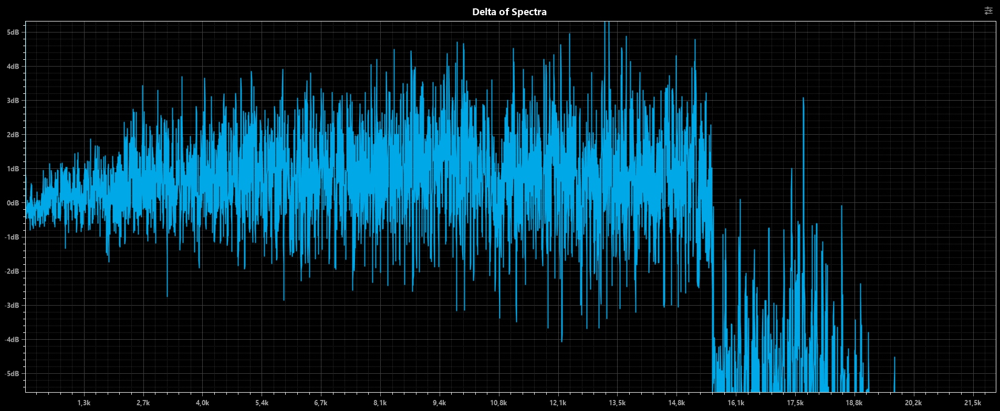
  <h2>Delta waveform (Lower is better)</h2>
  <h3>Ugoku, Hifi quality:</h3>
  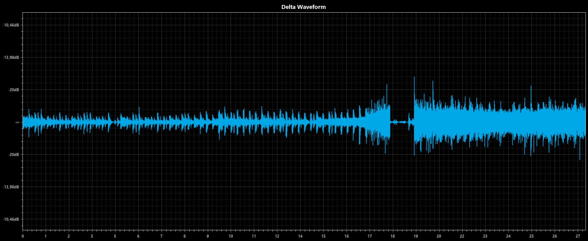
  <h3>Ugoku, High quality:</h3>
  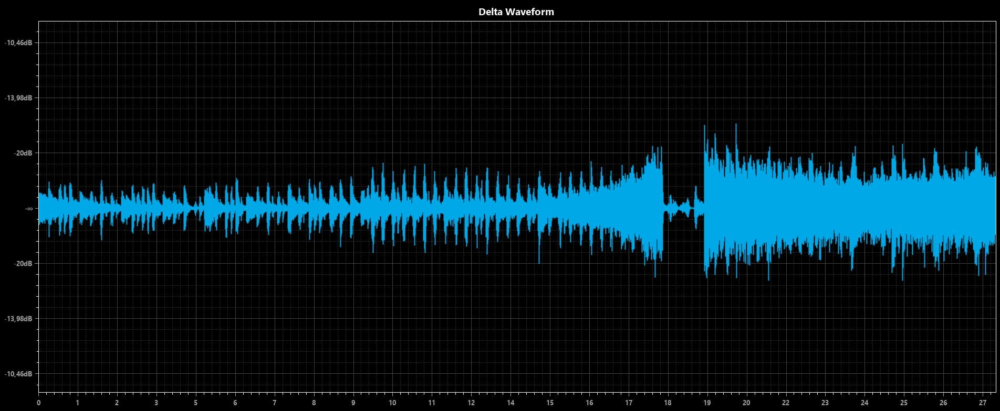
  <h3>Jockie:</h3>
  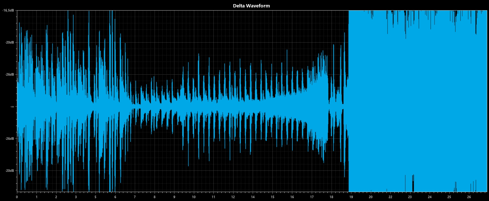
  <h2>Spectrum of delta (Lower is better)</h2>
  <h3>Ugoku, Hifi quality:</h3>
  
  <h3>Ugoku, High quality:</h3>
  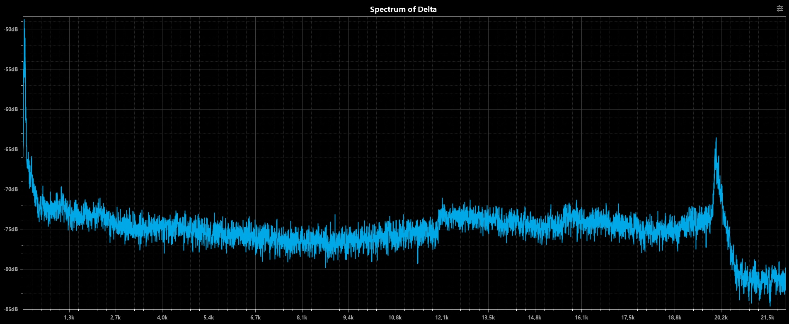
  <h3>Jockie:</h3>
  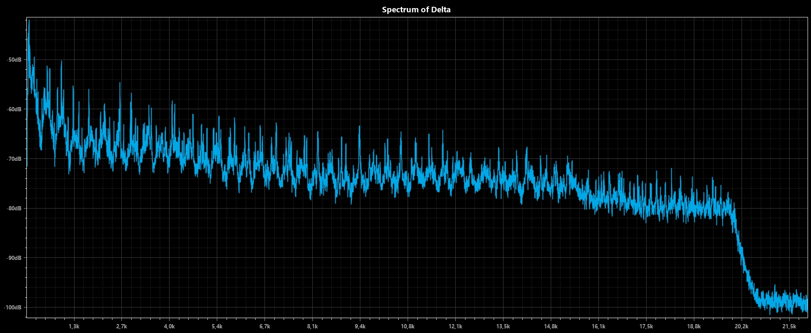

