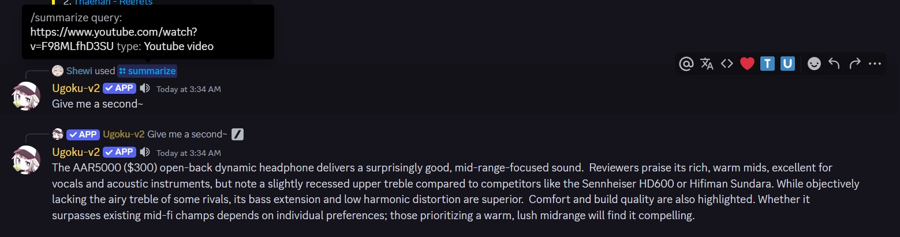

<div align="center">
  <a href="https://twitter.com/shironappa_">
      
  </a>
  <p>Art by Shironappa</p>
  <h1>Ugoku-v2 Discord Bot</h1>
</div>

**A work in progress rework of [Ugoku !](https://github.com/Shewiiii/Ugoku-bot)**, completely refactored and lightweight~  
Help command partially inspired by: https://docs.google.com/spreadsheets/d/1bhPYT3Z-WOlu0x1llrwOXc3lcO9RzXmrbfi08Mbt2rk

<h2>Features/To do</h2>

- [x] Ping.
- [x] Echo messages (make the bot say any message).
- [x] Download stickers from LINE.
- [x] Download songs from Spotify.
- [x] Download lossless songs from Deezer.
- [x] Play songs in a voice channel.
  - [x] Skip, Show queue, Autodetect and add songs/albums, or playlists.
  - [x] Loop song, Loop queue, pause, resume...
  - [x] Amazing audio quality: bypass the channel's audio bitrate.
  - [x] Stream songs from Spotify.
  - [x] Inject lossless streams to Spotify songs (when available on Deezer).
  - [x] Stream videos from Youtube.
  - [x] Stream audio works (音声作品) in a voice channel.
  - [x] Play songs from a URL (custom source).
  - [x] Apply audio effects (bass boost, reverb, etc), with high quality [Raum](https://www.native-instruments.com/en/products/komplete/effects/raum/) effects built-in !
  - [x] Cache audio from custom sources.
  - [x] Embed info messages with metadata.
  - [x] Show the lyrics of a song using the Musixmatch API
  - [ ] ~~(outdated) Control the bot using [this amazing UI](https://github.com/ChinHongTan/Ugoku-frontend) !~~
- [x] Chat using Gemini 2.0 flash. (WIP)
  - [ ] Optimize token usage.
  - [x] Make its messages more human-like.
  - [x] Have a permanent memory!
- [x] Review jpdb cards in Discord (sentences generated with Gemini).
- [x] Search any word in Japanese.
- [x] Get a random image from Danbooru (SFW only).
- [ ] And maybe more in the future~

<h2>Public playground bot</h2>

Chatbot features are disabled, but you can still play with the bot !
[Invite link](https://discord.com/oauth2/authorize?client_id=1260656795974897695)

<h2>Known bugs to fix</h2>

- Example sentences not always well chosen when reviewing jpdb cards (cause: Gemini's randomness in its response).
- The song in vc may stop randomly with Spotify (cause: Librespot session's connection closing).
- Audio may lag at the beginning of a song, when changing the audio effect or when seeking forward (causes: Discord client, slow Deezer/Spotify chunked input stream reading).
- Some Deezer songs may be unplayable. (cause: corrupted streams ?)

<h2>Requirements</h2>

- Python 3.12.x
- A Discord bot token (get one [here](https://discord.com/developers/applications))
- FFmpeg

Music bot (Optional but strongly recommended):

- A Spotify app (get one [here](https://developer.spotify.com/))
- A Deezer Premium or Spotify Premium account (YouTube will work by default)
- (Optional) An Imgur API key (get one [here](https://imgur.com/account/settings/apps)), to display the cover art for songs from custom sources.

Chatbot:

- A Gemini API key (get one [here](https://aistudio.google.com))
- (Optional) A Pinecone API key for long-term memory

<h2>Quick setup guide</h2>

- Install FFmpeg. You can follow [this guide](https://www.geeksforgeeks.org/how-to-install-ffmpeg-on-windows/) if you are on a Windows machine.
- Copy the repo.
- Create a virtual environment.

```bash
python -m venv venv
```

OR

```bash
python3 -m venv venv
```

- Enable the venv.

Windows:

```bash
./venv/Scripts/activate.bat
```

Linux:

```bash
source venv/bin/activate
```

- Install the dependencies.

```bash
python -m pip install -r requirements.txt
```

OR

```bash
python3 -m pip install -r requirements.txt
```

- [Create a bot and add it to a Discord server](https://guide.pycord.dev/getting-started/creating-your-first-bot), or add it to your apps. You can follow the first 3 sections of the guide.
- Create an .env file in the root directory.
- Set the environment variables for the services you want to use, based on the template.
- Restart the IDE (to update the env variables).
- Configure and activate the features in the config.py file.
- Run `main.py`.
- If Spotify is enabled, log in to Librespot from your Spotify client (it should appear in the device list)\*.
- Done !

> [!TIP] 
> \*This action will create a `credentials.json` file in the root folder. If you are having trouble creating it on a remote machine, try creating it on your local machine and exporting it.

<h2>Special Thanks</h2>

- Chinono智乃乃, for helping me with this project and inspiring me  
- Neutrixia, for providing improvement ideas for the music player  
- Nothes, for allowing me to use your public server as a platform for Ugoku  
- Everyone actively using my bot!

<h2>Random screenshots</h2>

<div align="center">
  
  <p>Playing a song</p>
  
  <p>Songs in queue</p>
  
  <p>Spotify song download</p>
  
  <p>Lyrics</p>
  
  <p>Youtube & text summary</p>
  
  <p>Help command</p>
  
  <p>Danbooru</p>
  
  <p>Review of a jpdb card</p>
  
  <p>Japanese word lookup</p>
</div>
